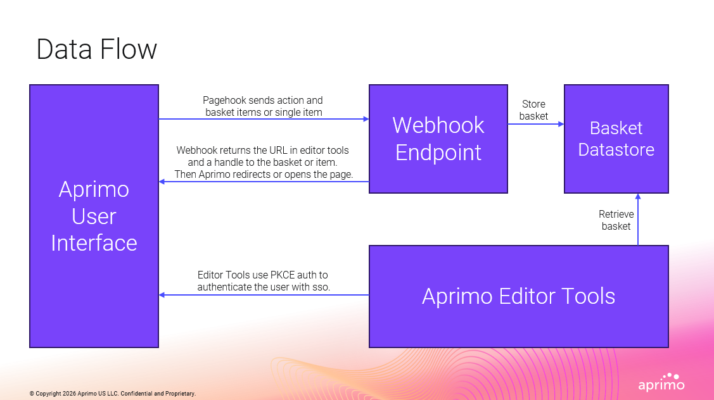

# Aprimo Editor Tools

A Next.js application for connecting to Aprimo using PKCE authentication and working with your DAM environment.

> **This is a community-supported project and is not officially maintained or supported by Aprimo.**

> **Aprimo JS SDK** — This project relies on the [Aprimo JS SDK](https://github.com/Timw255/aprimo-js) by [@Timw255](https://github.com/Timw255) for all Aprimo API communication, PKCE authentication, and file upload.

## Tools

### Bulk Upload

Upload assets to Aprimo with metadata in bulk.

- Drag-and-drop or browse to select multiple files
- Define shared fields whose values apply to every asset in the batch
- Override fields per asset where values differ
- Supports text, multi-line text, date, and classification field types
- Tracks upload progress and reports per-asset success or failure

### My Basket

Renders the contents of an Aprimo basket. Triggered via Aprimo page hook — record IDs are stored in Supabase and a handle is forwarded to the page. Use this as a starting point for building custom contact sheets or for exporting basket contents to Excel.

| Parameter | Source | Description |
|-----------|--------|-------------|
| `requestId` | Webhook (multi-record mode) | UUID handle used to fetch the record list from Supabase |

Webhook action: `mybasket` (default multi-record mode — no `&mode=singleitem`).

### My Item

Displays a single Aprimo record. Triggered via Aprimo page hook — the record ID is passed directly as a query parameter.

| Parameter | Source | Description |
|-----------|--------|-------------|
| `record` | Webhook (`&mode=singleitem`) | The Aprimo record ID to display |

Webhook action: `myitem` with `&mode=singleitem` appended to the webhook URL.

### Video Resizer

Resize and reformat a video asset for social media platforms, then save it back to Aprimo as an additional file. Triggered via Aprimo page hook — the record ID is passed directly as a query parameter.

| Parameter | Source | Description |
|-----------|--------|-------------|
| `record` | Webhook (`&mode=singleitem`) | The Aprimo record ID whose master video file will be loaded |

Webhook action: `videoresizer` with `&mode=singleitem` appended to the webhook URL.

- Supports Instagram, YouTube, TikTok, Facebook, LinkedIn, and X with preset aspect ratios and resolutions
- Adjustable crop mode (fill / fit), zoom, and rotation
- Output formats: MP4, MOV, WebM
- Live preview updates as settings change
- **Create Rendition** — processes the video in the browser using FFmpeg.wasm and uploads the result to Aprimo as an additional file on the master file's latest version
- **Create & Download** — processes the video and triggers a local download without uploading to Aprimo

> FFmpeg.wasm requires `Cross-Origin-Opener-Policy: same-origin` and `Cross-Origin-Embedder-Policy: credentialless` response headers on the `/video-resizer` route. These are already configured in `next.config.mjs`.

### Video Studio

A browser-based non-linear video editor. Select multiple Aprimo assets, arrange them on a timeline, add transitions, audio, and text overlays, then render the final video using FFmpeg.wasm — entirely in the browser with no server-side transcoding.

**Asset types**

| Type | Notes |
|------|-------|
| Video | MP4, MOV, WebM, AVI, MKV — trimmed and composited |
| Image | JPEG, PNG, WebP, etc. — held as a still for the clip duration |
| Audio | MP3, AAC, WAV, OGG, FLAC — placed on a separate audio track with independent trim |
| Text | Heading + body text burned into the video via `drawtext`; configurable font, size, color, opacity, and 9-point position grid |

**Timeline**

- Four tracks: **Video**, **Transitions**, **Audio**, and **Text**
- Drag assets from the sidebar onto any track
- Reorder and move video clips; set start times for audio and text clips
- Trim video clips with a frame-accurate trim editor (set in/out points)
- Mute individual video clips

**Transitions**

Drag a transition chip from the sidebar between two clips on the video track. Uses FFmpeg's `xfade` filter — supported types include fade, dissolve, wipe (left/right/up/down), slide, circle, pixelize, zoom, and more.

> **How transitions consume clip content.** An `xfade` transition of duration _N_ seconds works by blending the _last N seconds_ of clip A with the _first N seconds_ of clip B. This means those frames from both clips are visible but overlapped — they are not cut from the output, they are shared between the two clips during the blend. If this feels like frames are being lost, it is expected behavior: a 1-second fade will "use up" 1 second from the tail of clip A and 1 second from the head of clip B. To minimize this, shorten the transition duration — a 0.25-second fade consumes far less clip content than a 1-second fade — or use the **Disable Transitions** toggle for a hard cut (see below).

**Disable Transitions toggle**

The **Disable Transitions** switch in the bottom bar replaces all `xfade`/`acrossfade` filters with a simple frame-accurate `concat`. When enabled:

- The Transitions track is hidden and any placed transition chips are ignored during encoding.
- Clips are joined with a clean hard cut — no frames are shared between clips.
- Use this mode when exact clip boundaries matter more than visual blending effects.

**Output settings**

Choose a platform preset (YouTube, Instagram, TikTok, Facebook, LinkedIn, X, or custom), aspect ratio, crop mode (fill / fit), zoom, and rotation. Output formats: MP4 (H.264) and WebM (VP9).

**Actions**

| Button | Description |
|--------|-------------|
| Generate Preview | Renders a low-quality preview (360p / 720p / 1080p) for quick review |
| Create and Download | Renders the full-quality video and saves it to your machine |
| Save as Asset | Prompts for a project name, renders, uploads, and creates a new Aprimo record. On success, an **Open in Aprimo** button appears to jump to the new record. |
| State | Inspect the current project as JSON |
| Load | Restore a previously saved project from JSON |

**Save as Asset — environment variables**

The "Save as Asset" action requires three additional env vars (see `.env.local.example`):

```
NEXT_PUBLIC_VIDEO_STUDIO_CONTENT_TYPE=       # content type name or ID for the new record
NEXT_PUBLIC_VIDEO_STUDIO_CLASSIFICATION_ID=  # classification ID (Aprimo records require at least one)
NEXT_PUBLIC_VIDEO_STUDIO_JSON_FIELD=         # field name used to store the project state JSON
```

The full project state JSON (clips, assets, output settings) is written to the configured field so the project can be reloaded later using the **Load** button.

> FFmpeg.wasm requires `Cross-Origin-Opener-Policy: same-origin` and `Cross-Origin-Embedder-Policy: credentialless` response headers on the `/video-studio` route. These are already configured in `next.config.mjs`.

### Excel Import

Import metadata from an Excel file into Aprimo records.

- Upload an `.xlsx` / `.xls` file and select which columns to map
- Map Excel columns to Aprimo field definitions (auto-matched by name)
- Map classification values from the spreadsheet to Aprimo classifications
- Choose the target language for localized field values
- Saves to Aprimo using `records.update()` with built-in rate-limit handling

## Data Flow

1. **Pagehook trigger** — The Aprimo UI sends a page hook POST to the Webhook Endpoint containing the action name and one or more record IDs.
2. **Store basket** — For multi-record actions the Webhook Endpoint stores the record list in the Basket Datastore (Supabase) and generates a short-lived `requestId` handle.
3. **Redirect** — The webhook returns the Editor Tools URL with the handle (or record ID for single-item mode). Aprimo opens that URL in the user's browser.
4. **Retrieve basket** — The Editor Tools page fetches the record list from the Basket Datastore using the `requestId`, then deletes the row.
5. **PKCE auth** — Editor Tools authenticates the user against the Aprimo User Interface via PKCE OAuth / SSO before making any API calls.

## Framework

### Authentication

Connects to Aprimo using the PKCE OAuth flow via the [Aprimo JS SDK](https://github.com/Timw255/aprimo-js). Credentials are stored in `localStorage` after first use.

Connection can be pre-configured via environment variables so the modal is skipped entirely:

```
NEXT_PUBLIC_APRIMO_ENVIRONMENT=yourcompany
NEXT_PUBLIC_APRIMO_CLIENT_ID=your-client-id
NEXT_PUBLIC_APRIMO_CLIENT_SECRET=your-client-secret
```

If any variable is missing the app falls back to the connection modal.

### Webhook / Page Hook endpoint

`POST /api/webhook` receives page hook calls from Aprimo and redirects to the appropriate page. Actions are configured in `app/api/webhook/actions.json`:

```json
{
  "mybasket":     "https://your-deployment.vercel.app/my-basket",
  "myitem":       "https://your-deployment.vercel.app/my-item",
  "videoresizer": "https://your-deployment.vercel.app/video-resizer"
}
```

The action name in Aprimo maps to a key in that file. The record or basket ID is forwarded as a query parameter.

## Getting Started

### 1. Set up Supabase

The My Basket flow stores temporary record lists in Supabase.

1. Create a free project at [supabase.com](https://supabase.com).
2. In the Supabase SQL editor, run the schema from [`supabase/create_requested_records.sql`](supabase/create_requested_records.sql) to create the `requested_records` table.
3. Copy your project URL and anon key from **Project Settings → API**.

### 2. Configure environment variables

Copy `.env.local.example` to `.env.local` and fill in the values:

```
# Supabase (required for My Basket)
NEXT_PUBLIC_SUPABASE_URL=https://your-project.supabase.co
NEXT_PUBLIC_SUPABASE_ANON_KEY=your-anon-key

# Aprimo (optional — can also be entered via the in-app Connect modal)
NEXT_PUBLIC_APRIMO_ENVIRONMENT=yourcompany
NEXT_PUBLIC_APRIMO_CLIENT_ID=your-client-id
NEXT_PUBLIC_APRIMO_CLIENT_SECRET=your-client-secret

# Video Studio — Save as Asset (optional — only required if using that feature)
NEXT_PUBLIC_VIDEO_STUDIO_CONTENT_TYPE=       # content type name or ID for new records
NEXT_PUBLIC_VIDEO_STUDIO_CLASSIFICATION_ID=  # classification ID (records require at least one)
NEXT_PUBLIC_VIDEO_STUDIO_JSON_FIELD=         # field name used to store project state JSON
```

### 3. Install and run

```
npm install
npm run dev
```

### 4. Connect to Aprimo

This app requires a **PKCE OAuth registration** in your Aprimo environment.

1. In Aprimo, go to **Settings → Registrations** and create a new registration with the following settings:
   - **Grant type:** Authorization Code with PKCE
   - **Redirect URI:** `https://<your-site>.vercel.app/oauth/callback` (or `http://localhost:3000/oauth/callback` for local development)
2. Note the **Client ID** and **Client Secret** from the registration.
3. Open the app and click **Connect**, then enter your environment subdomain, Client ID, and Client Secret — or set the `NEXT_PUBLIC_APRIMO_*` environment variables above to skip the modal.

### 5. Register page hooks (optional)

To enable the My Basket and My Item flows, register page hooks in Aprimo pointing to `/api/webhook`. Add your action-to-URL mappings in [`app/api/webhook/actions.json`](app/api/webhook/actions.json).

### 6. Set up action definitions and menus in Aprimo (optional)

To wire up a page hook action in Aprimo, create an action definition using the Aprimo settings UI or API. Use the following structure as a template:

```json
{
  "name": "<action name>",
  "type": "pageHook",
  "translationKey": "<translation key>",
  "conditions": [],
  "parameters": {
    "sendToken": "none",
    "url": "https://<your-site>.vercel.app/api/webhook?action=<action>",
    "location": "New",
    "timeout": 30,
    "httpMethod": "POST"
  }
}
```

- **`name`** — matches the key in `actions.json` (e.g. `mybasket`, `myitem`)
- **`url`** — the full URL to your deployed app's `/api/webhook` endpoint with the `action` query parameter
- **`translationKey`** — the label shown in Aprimo menus

**Webhook modes**

By default the webhook expects multiple record IDs, stores them in Supabase, and returns a handle (`requestId`) to the destination page. For actions that pass only a single record (e.g. My Item), append `&mode=singleitem` to the URL — the record ID is forwarded directly without a Supabase round-trip:

```
# Multi-record (default) — stores record list and returns a handle
url: https://<your-site>.vercel.app/api/webhook?action=mybasket

# Single-record — passes the record ID directly
url: https://<your-site>.vercel.app/api/webhook?action=myitem&mode=singleitem
```

Once the action definition is created, add it to the appropriate Aprimo menu so users can trigger it from the basket or record view. Each menu entry references the action by name:

```json
{
  "name": "<action name>",
  "type": "action"
}
```

## Reference

### Data Flow


